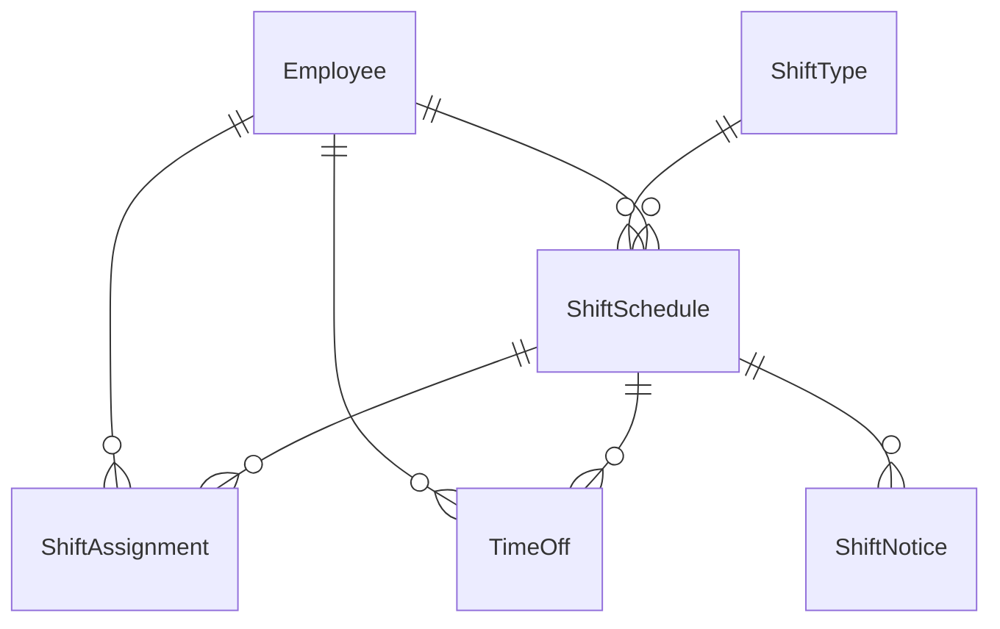

# エンティティ関連図

このドキュメントは、シフト管理システムのドメインモデルを表現するエンティティ関連図です。DDD（ドメイン駆動設計）に基づいて、エンティティの関連性を定義します。

## ドメインモデル概要

## エンティティ詳細

### Employee

従業員（集約ルート）

従業員情報を表すエンティティ。

### ShiftType

シフト区分（集約ルート）

早番・遅番などシフトの種類を表すエンティティ。

### ShiftSchedule

シフトスケジュール（集約ルート）

シフト全体を表すエンティティ。

#### ルール

- 1ヶ月に1つ存在する

### ShiftAssignment

シフトアサイン

従業員に対するシフトのアサイン情報を表すエンティティ。

### TimeOff

休日

従業員に対する休日の情報を表すエンティティ。

TimeOffTypeで公休や有給を表現する。

### ShiftNotice

シフト連絡

従業員への事務連絡を表すエンティティ。
