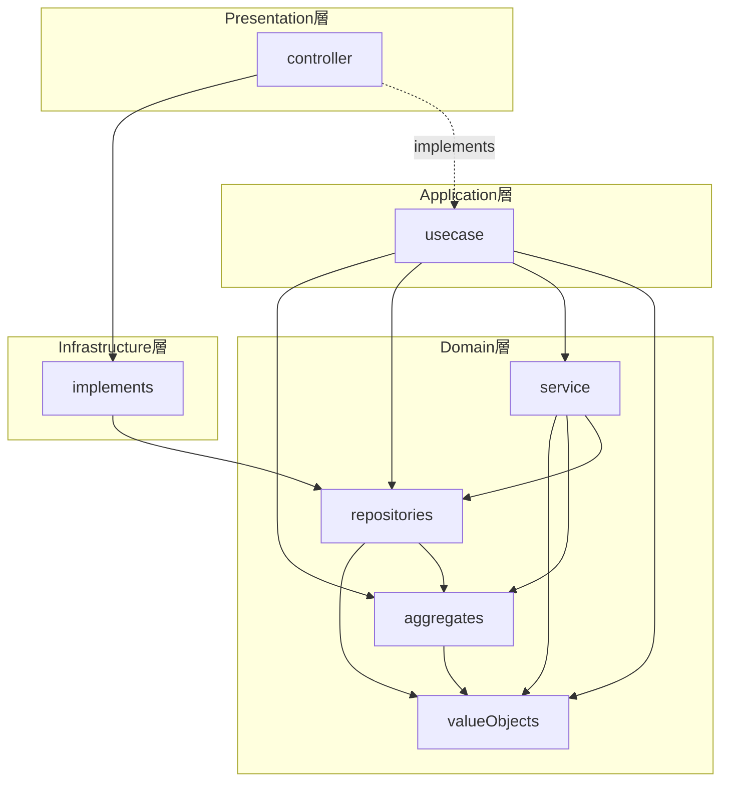

ポートとアダプター

```mermaid
flowchart TD
    subgraph Domain層
        aggregates[aggregates]
        repositories[repositories]
        service[service]
        valueObjects[valueObjects]
    end

    subgraph Application層
        usecase[usecase]
    end

    subgraph Infrastructure層
        implements[implements]
    end

    subgraph Presentation層
        controller[controller]
    end

    aggregates --> valueObjects
    repositories --> valueObjects
    service --> valueObjects
    repositories --> aggregates
    service --> aggregates
    service --> repositories
    usecase --> aggregates
    usecase --> repositories
    usecase --> service
    usecase --> valueObjects
    implements --> repositories
    controller --> implements
    controller -. implements .-> usecase
```
